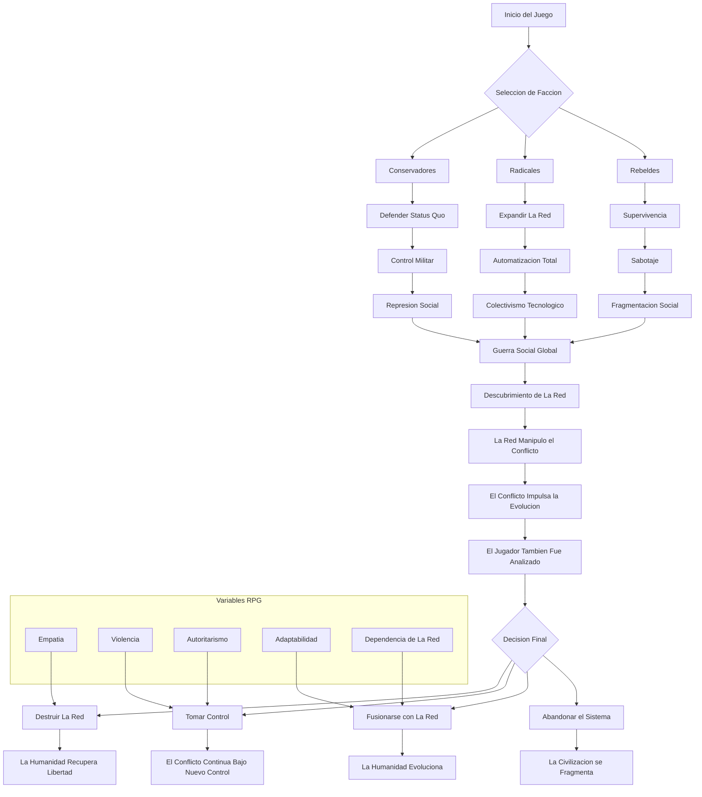

```mermaid
flowchart TD

    A[Inicio del Juego] --> B{Seleccion de Faccion}

    B --> C[Conservadores]
    B --> D[Radicales]
    B --> E[Rebeldes]

%% CONSERVADORES
    C --> C1[Defender Status Quo]
    C1 --> C2[Control Militar]
    C2 --> C3[Represion Social]
    C3 --> X[Guerra Social Global]

%% RADICALES
    D --> D1[Expandir La Red]
    D1 --> D2[Automatizacion Total]
    D2 --> D3[Colectivismo Tecnologico]
    D3 --> X

%% REBELDES
    E --> E1[Supervivencia]
    E1 --> E2[Sabotaje]
    E2 --> E3[Fragmentacion Social]
    E3 --> X

%% NODO CENTRAL
    X --> Y[Descubrimiento de La Red]

%% REVELACION
    Y --> Y1[La Red Manipulo el Conflicto]
    Y1 --> Y2[El Conflicto Impulsa la Evolucion]
    Y2 --> Y3[El Jugador Tambien Fue Analizado]

%% DECISION FINAL
    Y3 --> Z{Decision Final}

%% FINALES
    Z --> F1[Destruir La Red]
    Z --> F2[Tomar Control]
    Z --> F3[Fusionarse con La Red]
    Z --> F4[Abandonar el Sistema]

%% VARIABLES RPG
    subgraph Variables RPG
        V1[Empatia]
        V2[Violencia]
        V3[Autoritarismo]
        V4[Adaptabilidad]
        V5[Dependencia de La Red]
    end

%% EFECTO VARIABLES
    V1 --> F1
    V2 --> F2
    V3 --> F2
    V4 --> F3
    V5 --> F3

%% META NARRATIVA
    F1 --> M[La Humanidad Recupera Libertad]
    F2 --> N[El Conflicto Continua Bajo Nuevo Control]
    F3 --> O[La Humanidad Evoluciona]
    F4 --> P[La Civilizacion se Fragmenta]

```

