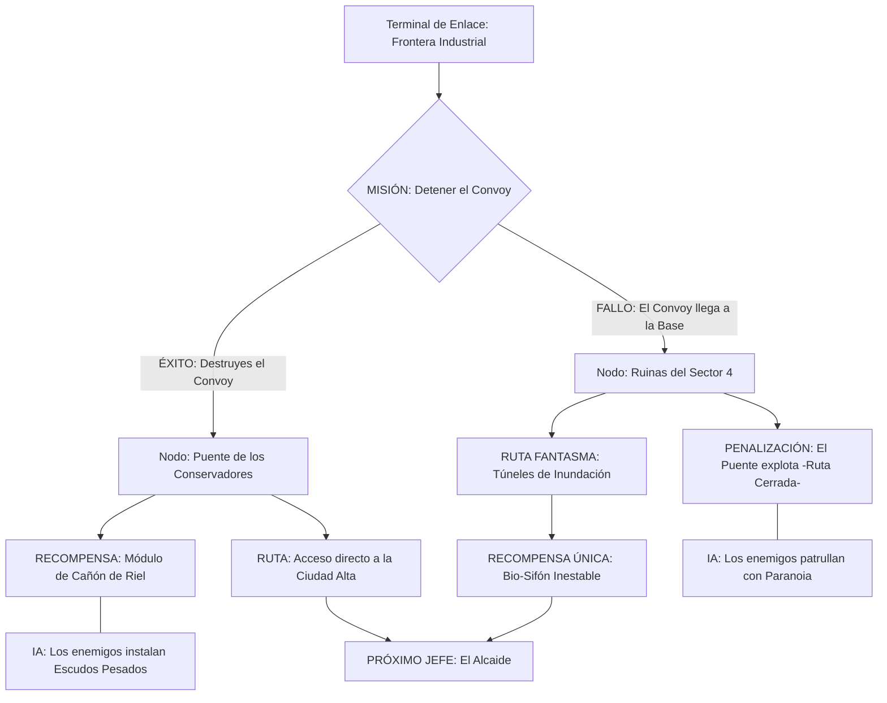

```mermaid
graph TD
    %% Nodo Inicial
    A[Terminal de Enlace: Frontera Industrial] --> B{MISIÓN: Detener el Convoy}

    %% Resultado de la Misión
    B -- ÉXITO: Destruyes el Convoy --> C[Nodo: Puente de los Conservadores]
    B -- FALLO: El Convoy llega a la Base --> D[Nodo: Ruinas del Sector 4]

    %% Ramificación Éxito
    C --> C1[RECOMPENSA: Módulo de Cañón de Riel]
    C --> C2[RUTA: Acceso directo a la Ciudad Alta]
    C1 --- C3[IA: Los enemigos instalan Escudos Pesados]

    %% Ramificación Fallo (La línea se mueve)
    D --> D1[PENALIZACIÓN: El Puente explota -Ruta Cerrada-]
    D --> D2[RUTA FANTASMA: Túneles de Inundación]
    D2 --> D3[RECOMPENSA ÚNICA: Bio-Sifón Inestable]
    D1 --- D4[IA: Los enemigos patrullan con Paranoia]

    %% Convergencia (El juego sigue)
    C2 --> E[PRÓXIMO JEFE: El Alcaide]
    D3 --> E
```

