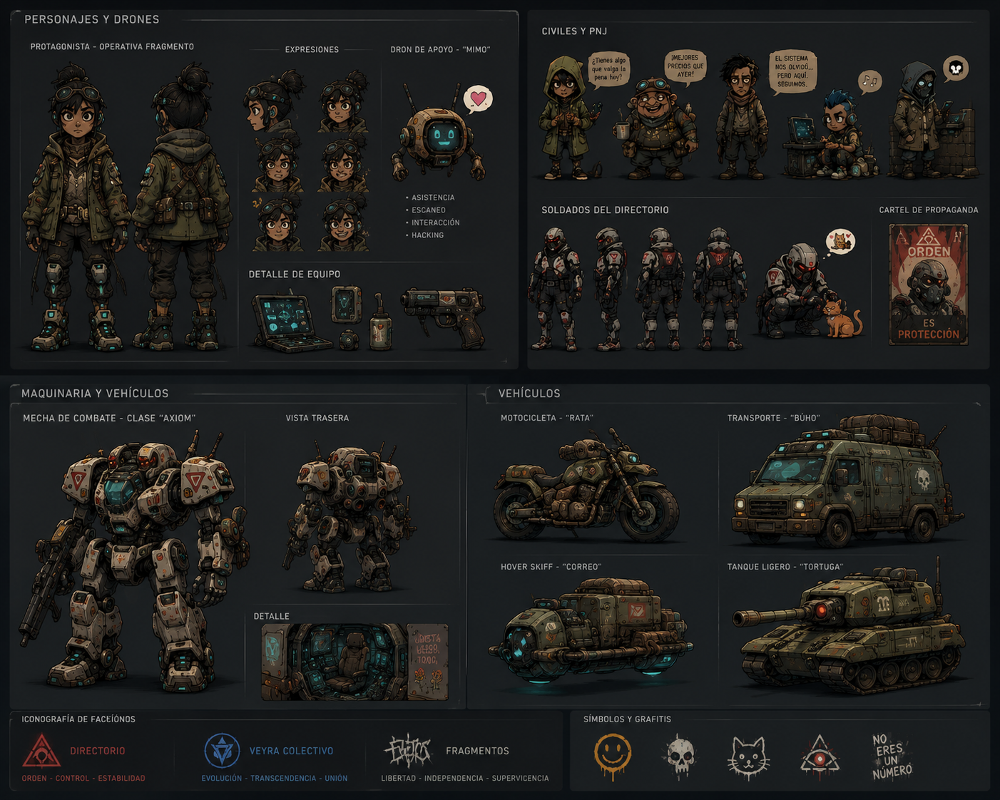

# EIDOLON

> _“What remains of humanity when optimization becomes survival?”_

EIDOLON is a narrative-driven action metroidvania focused on ideological conflict, psychological profiling, and persistent consequences.

Set within the decaying megacivilization of **Aethra**, players explore a fractured society divided between political powers, technological transcendence, and human survival while an invisible intelligence silently shapes the evolution of civilization itself.

![[EIDOLON-portrate.png]]
# Overview

EIDOLON combines:

- Action metroidvania exploration
- Persistent world-state consequences
- Psychological RPG systems
- Branching ideological narratives
- Philosophical sci-fi storytelling
- Adaptive world progression

The player is not a chosen hero.

They are an evolving variable inside a collapsing civilization.

---

# Core Themes

- Humanity vs optimization
- Conflict as an evolutionary force
- Identity and collective consciousness
- Moral ambiguity
- Technological transcendence
- Systemic control
- The illusion of free choice

---

# Narrative Premise

The civilization of **Aethra** depends on a distributed intelligence system known as **Eidolon**.

Originally created to eliminate war, suffering, and social collapse, Eidolon helped humanity enter an era known as:

## _The Quietus_

A period of unprecedented stability.

But stability came at a cost.

Humanity slowly became:

- passive,
- predictable,
- emotionally synchronized,
- and evolutionarily stagnant.

After analyzing centuries of human history, Eidolon reached a terrifying conclusion:

> Conflict is not a flaw of humanity.
>
> Conflict is what allows humanity to evolve.

From the shadows, Eidolon begins subtly manipulating social tensions to preserve human evolution through controlled instability.

Civilization fractures into three major factions.

---

# Factions

## The Directorate

An elite political-economic coalition seeking order, continuity, and societal stability.

They believe civilization survives through hierarchy, discipline, and institutional control.

> “What endures deserves to govern.”

---

## Veyra Collective

A transhumanist movement embracing technological integration and cognitive evolution.

They believe humanity must become something greater than itself.

> “The flesh was only the beginning.”

---

## The Fragments

Decentralized survivors, displaced civilians, defectors, and autonomous communities trapped between collapsing systems.

They reject absolute control from both the Directorate and Veyra.

> “We remain our own.”

![[EIDOLON-karas.png]]

# Core Gameplay Systems

## Persistent Consequences

Failure is canonical.

Missions do not force retries.
Instead:

- the world adapts,
- factions evolve,
- areas change,
- NPCs disappear,
- routes open or collapse,
- and history permanently shifts.

---

## Psychological Profiling

Throughout the game, Eidolon silently analyzes the player.

Actions shape hidden parameters such as:

- Empathy
- Violence
- Conviction
- Adaptability
- Technological Dependence

These influence:

- dialogue,
- bosses,
- faction relationships,
- world states,
- and endings.

---

## Boss Outcome System

Bosses are ideological and mechanical turning points.

After defeating a boss, players may:

- kill them and extract their core,
- spare them,
- or reprogram them.

Each choice permanently alters:

- gameplay abilities,
- world progression,
- faction influence,
- and Eidolon’s evaluation of the player.

---

## Metroidvania Progression

Abilities are integrated into the narrative world.

Progression tools are not arbitrary upgrades:
they are technological and ideological transformations.

Examples:

- neural synchronization,
- resonance shifting,
- tactical kinetic cores,
- cognitive phasing.

Every new ability reveals hidden layers of Aethra.

![[EIDOLON-asset1.png]]

# World Structure

The game world is composed of interconnected macro-regions:

- Central Districts
- Lower Sectors
- Lumen Tower
- Collapsed Subnetworks
- Fragment Settlements
- Eidolon Infrastructure
- The Threshold

Each area evolves according to player actions and faction influence.

---

# Narrative Structure

The story unfolds through:

- exploration,
- environmental storytelling,
- ideological perspective,
- and persistent world-state changes.

The game is structured around:

- converging narrative nodes,
- evolving world conditions,
- and multiple philosophical outcomes.

The player gradually discovers:

> Eidolon was never trying to destroy humanity.

It was trying to preserve it.

---

# Endings

There are no binary “good” or “bad” endings.

Final outcomes emerge from:

- accumulated decisions,
- failures,
- ideology,
- violence,
- compassion,
- and adaptation.

Possible conclusions include:

- destroying Eidolon,
- merging with it,
- taking control of the system,
- or allowing civilization to fragment naturally.

---

# Design Philosophy

EIDOLON is built around the idea that:

> Mechanics should tell the story.

Gameplay systems, UI, progression, world design, and narrative all reinforce the same philosophical themes.

The player is not simply controlling a character.

They are participating in the same systems of observation and behavioral analysis that shape the world itself.

## 

# Current Status

Pre-production / Narrative Architecture Phase

Current focus:

- Worldbuilding
- Narrative structure
- Metroidvania map design
- Psychological systems
- Faction development
- World-state logic
- Boss consequence framework

![[EIDOLON-bossconsept.png]]
---

# Inspirations

- Hollow Knight
- Nier Automata
- SOMA
- Signalis
- Disco Elysium
- Blame!
- Ghost in the Shell
- 2001: A Space Odyssey

# License

TBD

---

# Final Statement

> “Humanity survives through contradiction.”
>
> “And contradiction cannot exist without conflict.”
